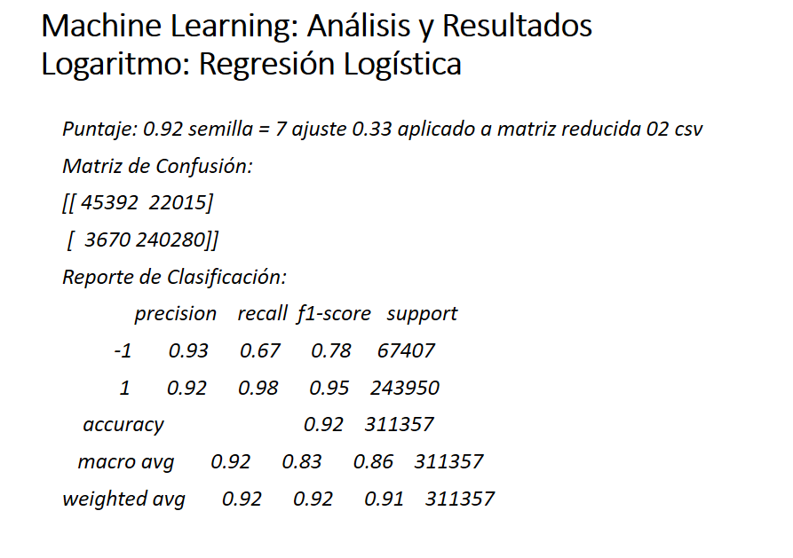
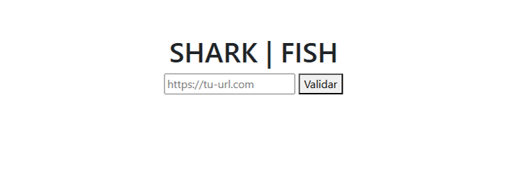

# C-22-38-T-DataBi
### Simulación Laboral de No-Country 
## No-Country - Area Data-Bi
# SharkFish - Análisis y Proyección de Seguridad Web para la detección de Phishing
### Objetivo: 
## Este proyecto tiene como objetivo analizar + proyectar, en el ámbito de la seguridad web, para detectar phishing.

### Industria: Ciberseguridad
## Colaboradores:
### 1.- Florencia Saldico (Data Analyst) https://www.linkedin.com/in/fsaldico
### 2.- Marisol Quinteros (Data Science) https://www.linkedin.com/in/marisol-quinterosbz-1r9
### 3.- Elsa Beltrán (Machine Learning) https://www.linkedin.com/in/elsa-beltran-vivanco

## Tecnologías: 

### IDE:VSCode - Lenguaje: Python,R - Notebook:Jupyter - Library:Matplotlib,Seaborn,Scikit.Learn,Kaggle - Plataform: GitHub,Power.Bi,Jira,RStudio -  Version.Control: Git -  Chat: Slack-Discord-Whatsapp - Tool: Google.Meet , Google.Drive

## Enlaces : 
### https://github.com/No-Country-simulation/C-22-38-T-DataBi

# Etapas del Proyecto:
## Etapa 0:
### Seleccionar un confiable dataset, para este proyecto.
### Nuestras fuentes de origen fueron:
### https://data.mendeley.com/datasets/vfszbj9b36/1
### https://www.kaggle.com/datasets/taruntiwarihp/phishing-site-urls/data

## Etapa 1:
### Preparación del dataset, esto implica, filtrar duplicados, columnas vacías, valores NaN..etc
### Agregar , desde nuestro análisis previo, nuevas columnas al dataset, que enriquezcan el análisis de cada Url, adjunta
### Normalizar sus valores,esto permitirá acotar, cada dato, de cada registro entre el rango [0, 1]
### Aplicar al dataset ya normalizado, la varianza a sus valores, esto nos permitirá seleccionar columnas, es decir, se eliminarán aquellas columnas cuya varianza se acerque a 0

## Etapa 2:
### Seleccionamos 3 algoritmos de automatización, para crear un modelo predictivo con Machine Learning
### Los algoritmos a probar son:
### 1.- Gradiente de Boosting
### 2.- Random Forest
### 3.- Regresión Logística
### Seleccionaremos el algoritmo, que , al ser entrenado, nos entregue el "Mejor Resultado".
### El  criterio para definir el "Mejor Resultado", implica maximizar los aciertos y disminuir los errores

## Etapa 3:
### Utilizar el modelo ya entrenado y seleccionado

# Semana 1
### Iniciamos el estudio a partir de una url, ejemplo:
### "www.python.com/es/area234GFr/caracteristicas"
### Nuestro enfoque para crear nosotras cada campo y por lo tanto tener el control para diseñar asi el mejor modelo de entrenamiento, nos lleva rigurosamente a crear campos, desde, el largo de la url, detectar subdominios, hosting, caracteres especiales, el alfabeto, mayusculas y minusculas..etc
### Estudiando y analizando el problema de phishing, aprendemos que, al problema de phishing, para ser resuelto con ML, se debe aplicar un modelo de aprendizaje automatizado, a raiz de esta informacion, seleccionamos 4 algoritmos: 
### a.- Regresión Logistica
### b.- Gradiente de Bootstring
### c.- Random Forest
### d.- Redes Neuronales
### Al contar con un primer dataset version 1.0, se a entrenado c/u de estos modelos: con sus respectivos resultados

### Se concluye que, invertir tiempo en, preparar un mejor dataset,incrementando columnas de interes, mejorara los resultados y ofrecera mayor competencia al momento de la seleccion del mejor algoritmo de prediccion

# Semana 2
### Nuestro objetivo mas ambicioso, como equipo, es generar una deteccion dinamica de phishing,desde un sitio web, para ello se entrena y busca el mejor modelo de prediccion

### Para alcazar nuestro objetivo mas alto, se instala en el repo de github, Django, un Framework vinculado a Python, tremendamente robusto y solido. Se inicia la preparacion del mismo, se simplificara para poner foco y enfasis en lograr recibir e interpretar una url externa y mostrar dinamicamente por medio del modelo ya  entrenado, que tipo de url se ingreso, phishing o segura.

# Semana 3
### Contamos ya, con el deploy de nuestro sitio web, en Render

### El equipo esta enfocado, trabajando en:
### 1.-Visializacion grafica del dataset, que se utiliza para aplicar el entrenamiento y seleccion del Modelo, se trabaja en mostrar los datos del dataset, para pintar en un dashboard los mas relevantes
### 2.- Se trabaja en mejorar el logo de Shark|Fish
### 3.- Estudiaremos pronto si incluiremos Cloudinary para imagenes
### 4.- Analizamos que herramienta para graficar esta data y mostrar su informacion de manera dinamica en un dashboard utilizaremos Power Bi o RStudio

### 5.- Se inicia la integracion a traves de Django con la vista y el template de usuario, comenzando a recibir data para analizar y ajustar resultados para lograr asi la prediccion y alcanzar nuestro objetivo mayor, " Crear un sitio web que nos permita, por medio de un input,como interfaz de usuario, recibir una Url y de manera interna con el modelo ya entrenado predecir, si, esta Url es phishing o segura, pintando esa informacion al usuario
### Adjunto primeros inicios de integracion de codigo, en Django + Vista + Template:

### Ingresamos Url desde pagina web

### Se captura url ingresada y se conecta a vista + template de Django, esto da inicio a los posteriores ajustes para la interpretacion y su pediccion